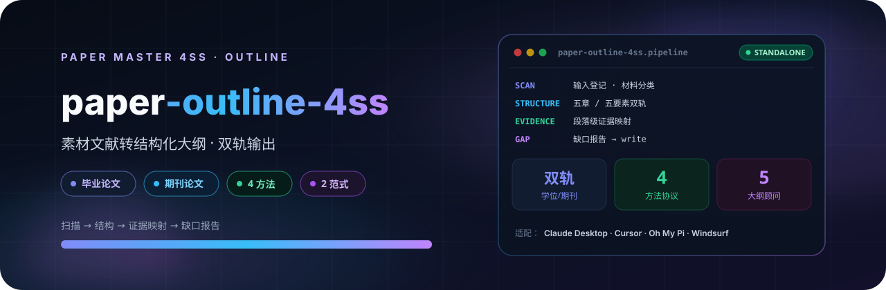

<p align="center">
  
</p>

# Paper 论文大纲 4SS

将用户指定输入路径、master 输入登记表或当前目录候选材料转换为结构化论文撰写大纲。支持毕业论文（五章结构）和期刊论文（五要素紧凑结构）双轨输出，支持规范研究、实证研究、阐释研究、混合研究四种方法协议，以及社会学研究范式和管理世界案例研究范式两类发表风格。当用户需要从已有文献素材生成论文大纲、将材料转化为写作框架、或需要论文结构设计时使用。

## 4SS 家族

| 包 | 职责 |
|---|---|
| [paper-master-4ss](https://github.com/JingYangYuan/paper-master-4ss) | 总控：登记输入、选择模块、维护工作区 |
| [paper-design-4ss](https://github.com/JingYangYuan/paper-design-4ss) | 选题、框架路由、研究设计蓝图 |
| [paper-lit-4ss](https://github.com/JingYangYuan/paper-lit-4ss) | 中英文检索、文献地图、空白与假设 |
| **[paper-outline-4ss](https://github.com/JingYangYuan/paper-outline-4ss)**（本仓库） | 素材转大纲、证据映射、缺口报告 |
| [paper-analysis-4ss](https://github.com/JingYangYuan/paper-analysis-4ss) | 定量 / 质性 / 混合，Stata · R · Python |
| [paper-write-4ss](https://github.com/JingYangYuan/paper-write-4ss) | 章节写作、润色、语言扫描、正文净稿 |
| [paper-check-4ss](https://github.com/JingYangYuan/paper-check-4ss) | 全文审稿、质量门控与精确回流 |
| [paper-submission-4ss](https://github.com/JingYangYuan/paper-submission-4ss) | Word 导出、体例、投稿清单与信函 |
| [paper-update-4ss](https://github.com/JingYangYuan/paper-update-4ss) | 待审核更新包，不直接改核心文件 |

## 它做什么

把已有文献素材转成可直接用于写作的结构化大纲：材料扫描 → 结构构建 → 段落级证据映射 → 缺口报告。

## 双轨与协议

| 项 | 选项 |
|---|---|
| 输出轨道 | 毕业论文（五章） / 期刊论文（五要素） |
| 方法协议 | 规范、实证、阐释、混合 |
| 发表风格 | 社会学研究范式 / 管理世界案例研究范式 |

## 安装

将本目录放到宿主的 skill 目录。入口见 `SKILL.md`。

```bash
git clone https://github.com/JingYangYuan/paper-outline-4ss.git
```

与 [`paper-master-4ss`](https://github.com/JingYangYuan/paper-master-4ss) 同级安装时，跨模块路径才能解析。只做本模块任务也可以单独使用。

## 与总控的关系

本包由总控 [`paper-master-4ss`](https://github.com/JingYangYuan/paper-master-4ss) 导出；对应源目录是总控包内的 `modules/outline/`：

- 包内相对路径相对本包根目录解析
- `master/` 与部分 `references/` 是导出时的协议快照
- 更新方式：修改总控任一模块、家族表、路由或协议后，必须无参数重新导出**全部**独立包并 push 全部 GitHub 仓；不要只改本仓库，也不要只导出改过的那一个。

## License

[MIT](LICENSE)
